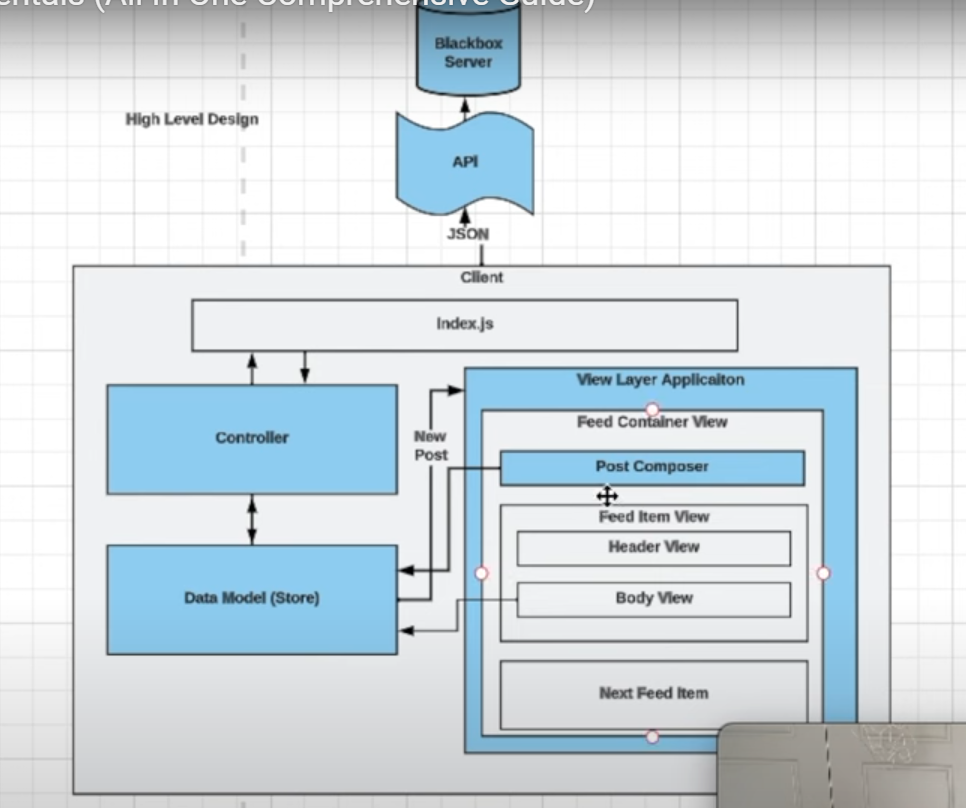

## Frontend System Design

- Youtube - Frontend Engineer and JSer
- You are given a piece of UI, design the Components for it. its accessibility, its performance, component hierarchy, props hierarchy, data passing, what states are we storing.

# Radio Approach

- Differnt steps to do for system design interview.
- (R) Requirements - Functional & non-functional.
- (A) High Level Architecture - Design components that will be required to build the feature.
- (D) Data Model (Client) - Data type, store
- (I) API Model - What kind of HTTP protocal we will be using, tradeoffs between each one. Then craete API layer, api names , post/get etc.
- (O) Optimizations/Performance - Network performance, rendering performance, security, accessibility etc.

## Requirements

- Give 5-10 minutes to think about requiremnets.

#### Functional for News Feed

- Feed that displays a list of items.
- Feed items can include comments
- We are only concerned about user post type.
- Infinite Scroll.

#### Non-Functional

- Must be Mobile-friendly.
- Does not need to work offline, but it would be nice if some data is accessible offline.
- Should be a11y friendly.
- Should support internationalization. i18n
- Should be performant. Have a low latency(delay in network communication ) here.
- Nice to have an idea of napkin math expected volume, helps estimate the observability. Eg, Datadog is a observability tool.

## High Level Architecture

#### Requirements for HLA

- Start with a simple UI design
- Then design the Component Architecture like below is for News Feed.
  
