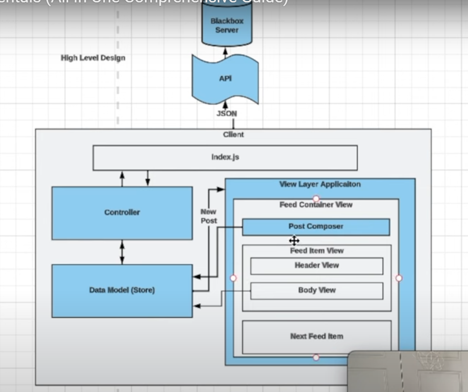
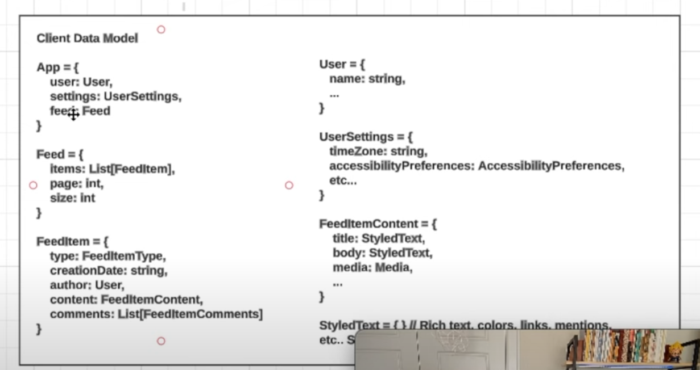
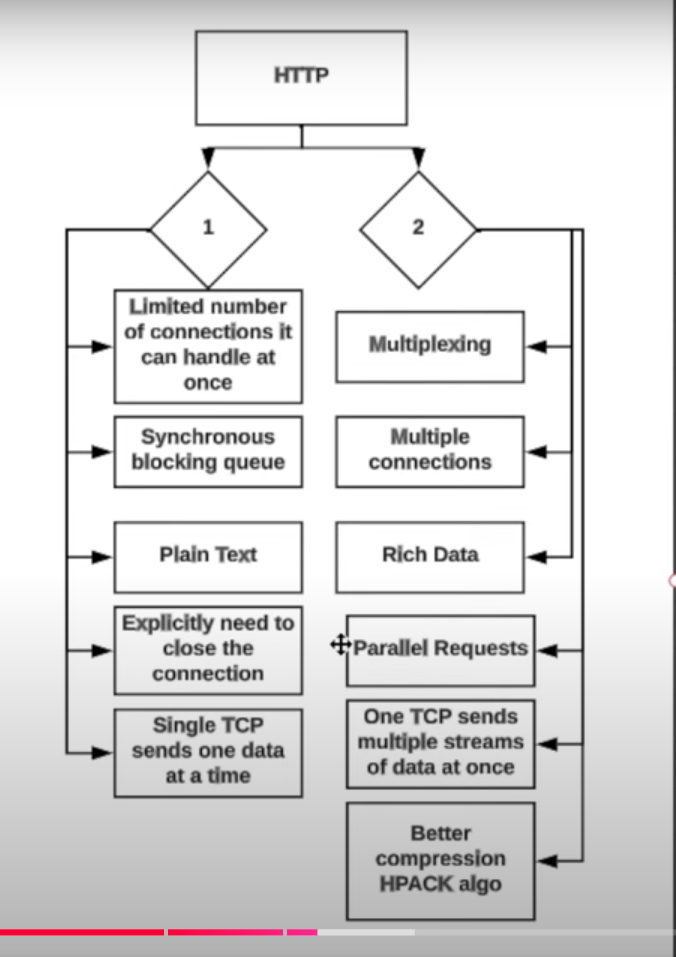
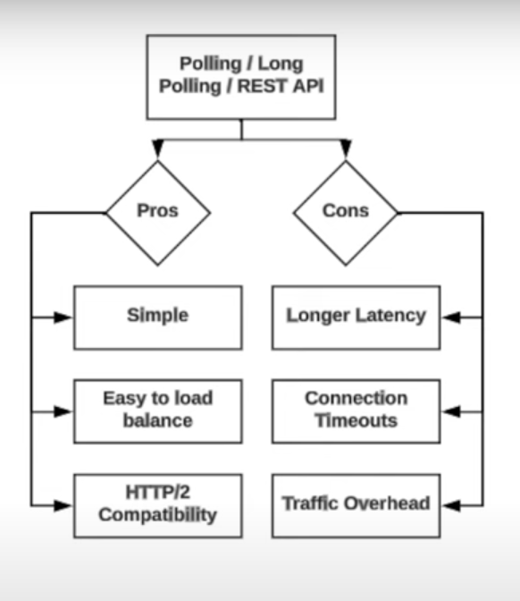

## Frontend System Design

- Youtube - Frontend Engineer and JSer
- You are given a piece of UI, design the Components for it. its accessibility, its performance, component hierarchy, props hierarchy, data passing, what states are we storing.

# Radio Approach

- Differnt steps to do for system design interview.
- (R) Requirements - Functional & non-functional.
- (A) High Level Architecture - Design components that will be required to build the feature.
- (D) Data Model (Client) - Data type, store
- (I) API Model - What kind of HTTP protocal we will be using, tradeoffs between each one. Then craete API layer, api names , post/get etc.
- (O) Optimizations/Performance - Network performance, rendering performance, security, accessibility etc.

## Requirements

- Give 5-10 minutes to think about requiremnets.

#### Functional for News Feed

- Feed that displays a list of items.
- Feed items can include comments
- We are only concerned about user post type.
- Infinite Scroll.

#### Non-Functional

- Must be Mobile-friendly.
- Does not need to work offline, but it would be nice if some data is accessible offline.
- Should be a11y friendly.
- Should support internationalization. i18n
- Should be performant. Have a low latency(delay in network communication ) here.
- Nice to have an idea of napkin math expected volume, helps estimate the observability. Eg, Datadog is a observability tool.

## High Level Architecture

#### Requirements for HLA

- Start with a simple UI design
- Then design the Component Architecture like below is for News Feed.
  Index.js gives data to Controller and Controller is responsible for bringing the data which is coming from API and manipulating it, parsing it and we can store it in our Data Model Store.
  The Data Model is then calling our View Layer and passing the data.
  The View layer has the actual Component, it can have child Components as well.
  The child components can also communicate with our Controllers to Post new data taken from user, like comments or New Post etc..
  This is like a MVC design pattern.
  

- Discuss what Design Pattern you want to use and why.
  MVC is a good approach and its easy to organize code, and each component has its own purpose.
  Model - Data store
  View - UI
  Controller - Business logic
- Explain how much the data will flow.
- Explain how interactions will work.

## Data Model

- Build out the Data types to render the content on the client. Below is the states of the Components.

  

## API Model

- What HTTP protocol to use and why.

- Api Options

