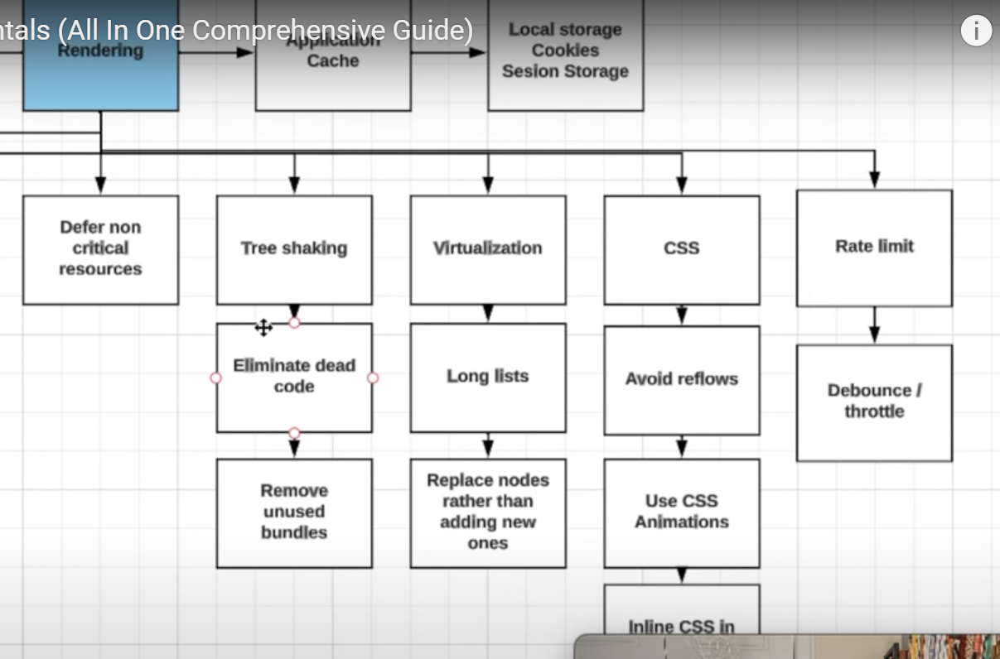

## Frontend System Design

- Refernce - https://www.youtube.com/watch?v=NEzu4FD25KM
- Youtube - Frontend Engineer and JSer
- You are given a piece of UI, design the Components for it. its accessibility, its performance, component hierarchy, props hierarchy, data passing, what states are we storing.

# Radio Approach

- Differnt steps to do for system design interview.
- (R) Requirements - Functional & non-functional.
- (A) High Level Architecture - Design components that will be required to build the feature.
- (D) Data Model (Client) - Data type, store
- (I) API Model - What kind of HTTP protocal we will be using, tradeoffs between each one. Then craete API layer, api names , post/get etc.
- (O) Optimizations/Performance - Network performance, rendering performance, security, accessibility etc.

## Requirements

- Give 5-10 minutes to think about requiremnets.

#### Functional for News Feed

- Feed that displays a list of items.
- Feed items can include comments
- We are only concerned about user post type.
- Infinite Scroll.

#### Non-Functional

- Must be Mobile-friendly.
- Does not need to work offline, but it would be nice if some data is accessible offline.
- Should be a11y friendly.
- Should support internationalization. i18n
- Should be performant. Have a low latency(delay in network communication ) here.
- Nice to have an idea of napkin math expected volume, helps estimate the observability. Eg, Datadog is a observability tool.

## High Level Architecture

#### Requirements for HLA

- Start with a simple UI design
- Then design the Component Architecture like below is for News Feed.
  Index.js gives data to Controller and Controller is responsible for bringing the data which is coming from API and manipulating it, parsing it and we can store it in our Data Model Store.
  The Data Model is then calling our View Layer and passing the data.
  The View layer has the actual Component, it can have child Components as well.
  The child components can also communicate with our Controllers to Post new data taken from user, like comments or New Post etc..
  This is like a MVC design pattern.
  

- Discuss what Design Pattern you want to use and why.
  MVC is a good approach and its easy to organize code, and each component has its own purpose.
  Model - Data store
  View - UI
  Controller - Business logic
- Explain how much the data will flow.
- Explain how interactions will work.

## Data Model

- Build out the Data types to render the content on the client. Below is the states of the Components.

## API Model

- What HTTP protocol to use and why. Spend 10% time here.
- We have 3 options, LongPolling (RestAPI), websockets, or SSE

### Long Polling

- HTTP benefits
- Simple and managebile
- Latency can be preety long
- Connection timeout, specially bcz of proxies
- Easier to Load Balance
- Traffic overhead - TCP is connection oriented. Anything sent has to make it and has to be accounted for in the correct order too. So it takes more information to make that happen. That extra information is referred to as overhead.

### Web Sockets

- Duplex communication (2-way)
- Websockets are super fast
- Keeping a WS connection is expensive
- HTTP2 compatible
- WS are hard to load balance
- Need to do a lot of stuff that is already done in HTTP2 protocol
- Using WS can be problomatic with firewalls and proxies filtering TCP traffic

### SSE ( Server side events)

- HTTP2 benefits
- We recieve only a piece of our data in text format
- SSE events dont waste device resource. Its resource-efficient
- SSE are easier to load balance with correct server config
- Weird API
- Unidirectional
- Text data

### Api Options

- Polling or Long/Short or RestApi is simple, industry standard, its esay to load balance, its HTTP2 compatible, but the cons is Longer latency, we send request headers, body and then we wait for backend to parse that data, authenticate user and then return back to client as response, thats why high latency is there.

- GraphQL - Pros is that its very modern, easy to load balance, and mainly that it loads only the data that we need.

  Pros

- Highly flexible, you can request only the data that you need
- All benefits of SSE over HTTP2
- We dont need to craete multiple api endpoints, easy to scale.

  Cons

- We need a client that supports subscription over SSE or implement our own
- No HTTP caching, graphql works over POST, we need to rely over client library to cache request.

- Websockets - We open only 1 TCP connection and send, recieve data there. Hard to load balance for backend.

- Server side Events - Follows Http2, easier to Load balance, has limited data types, hard to use

## Optimization & Performance

    Spend 40% time here.

- Optimizations
- Security
- A11y
- Observability/ Tracking

### Optimization

- Network - Header compression ( like gzip or brotli) Gzip is a compression technology for transferring data quickly over the internet.
- We can bundle split the entire code into multiple bundles, some non-critical resources can be loaded later using link = "preconnect", bundles for old browser ( having polyfills etc).
- Caching stratergies for Client (Apollo Caching, this is built in GraphQL)
- Group multiple tracking requests in a single request so server does not have to process a lot of requests in a single go.
- Image Optimizations - Pull compressed and specific sized images. This is one of the most imp points.
- Bundle Splitting - Lazy load, separate out app code and analytical stuff or code form other vendors, compress html js css.

Rendering

### Accessibility (A11y)

1. Support different color schemas for people with color blindeness disablilities.
2. All inputs and text areas should have aria-live.
   Aria roles is most imp here.
3. Images also need to have alt attributes.
4. Hots keys(or keyboard shortcuts) like Scroll up, Scroll Down, Call for help etc..
5. Use scalable units, fonts ( by using rem)
6. Make sure items are tabbable
7. Use the right HTML tags
8. Make sure you have Focus control

### Security

- Rate Limiting is done to prevent DDOS attack, so network request are send between certain intervals.
- XSS - Most imp one, Cross Side Scripting attacks - People can inject their own Javascript in our webpage, and if our webpage can communicate with server, then the server is highjacked from our client using plain JS. For this we need to make sure that html text nodes are parsed for various Js tags, like opening tags and closing tags. Or using innerText instead of innerHTML
  Reference - https://www.youtube.com/watch?v=ns1LX6mEvyM&t=11s

- Encapsulate Dom components
  - Limit access to DOM using web components(Custom Elements, ShadowDom etc)
  - Expose only limited customization using class API ( use # for private variables and function in custom elements)
- Filter the data before sending it to the server

### Performance

#### Javascript

- Try using Web Workers
- Avoid Sync jobs
- Ship as less polyfills as we can

#### Rendering

- Efficient classnames for CSS
- Try using CSS Animations instead of heavy animation files.
- Avoid reflows(Dom rebuilding or repaints)
- Reduce DOM writes
- Lazy Dom updates
- Implement Virtualization
- Use placeholders or Skeletons

### Scalability

- For medium size companies - Module separation of different pages in the website
- scaling at backend first , horizontal scaling, using proxy server, stateless (do not save states in server, store it in redis server)
- AWS lambda is usefull in above point as it can automatically scale horizontally, or shrink so we only pay for the cost while the code is executing.
- For big companies- For DB's - Redis and MongoDB - we can use Distributed Database ( fauna DB, planetscaleDB ) these DB's expose ur DB's over an HTTP server and manage the internal read-write part themselves.
